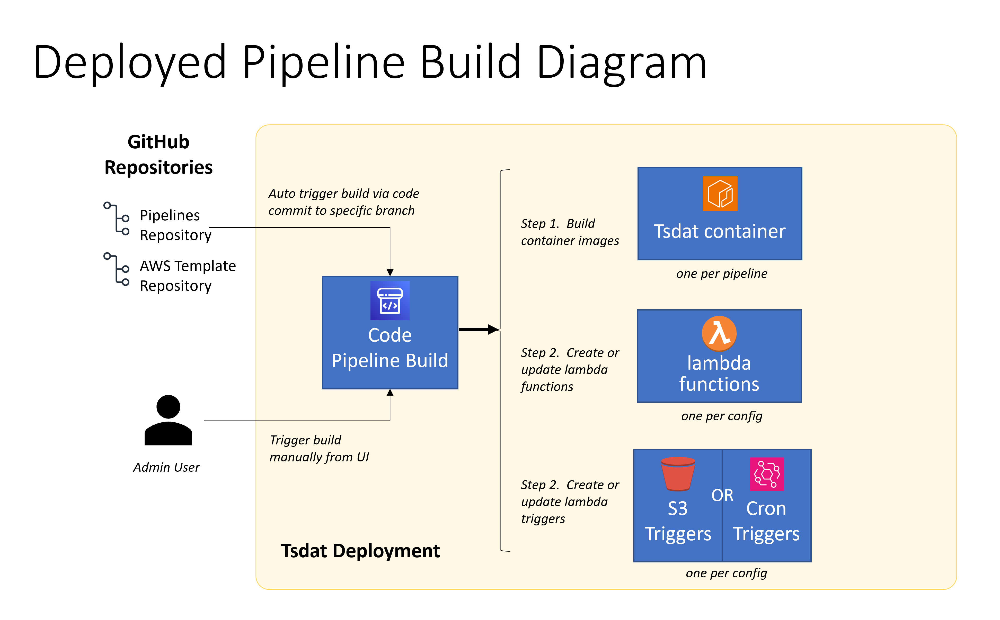
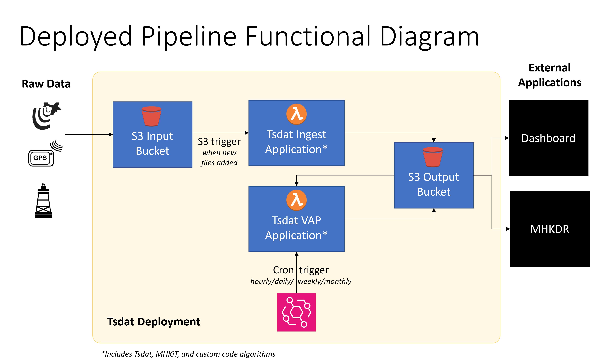

# Deploying Tsdat Pipelines to AWS
This repository contains everything needed to deploy your Tsdat pipelines to Amazon
Web Services (AWS).  The following picutures give a high level overview of the
build process and what resources are created in AWS.


 


```python
# NOTE: This deployment can only be run by AWS administrators, so we assume the user has
# a basic understanding of code development, Docker containers, and the AWS cloud.
```

# Prerequisites

### **1. Create GitHub Repositories from Template**
Make sure that you have created two new repositories in your GitHub organization from the
following template repositories:
1. https://github.com/tsdat/pipeline-template
2. https://github.com/tsdat/aws-template

<span style="color:red"><b>NOTE:  If you are using an existing pipelines repository, make sure that the
requirements.txt file updates the tsdat version to `tsdat >=0.7.1` as the AWS
build will not work with lower versions!</b></span>

### **2. Get an AWS Account**
In order to deploy resources to AWS, you must have an account set up and you **must have
administrator priviledges** on that account.  If you do not have an AWS account or you
do not have admin priviledges, then you should contact the local cloud administrator
for your organization.

### **3. Create an AWS CodeStar Connection to GitHub**
https://docs.aws.amazon.com/dtconsole/latest/userguide/connections-create-github.html#connections-create-github-console

**Don't forget to copy the ARN of your connection to the pipelines_config.yml file.**

### **4. Install Docker**
We use a Docker container with VSCode to make setting up your development environment
a snap.  We assume users have a basic familarity with Docker containers. If you are 
new to Docker, there are many free online tutorials to get you started.

*NOTE: Because Docker Desktop can be flaky, especially on Windows, we recommend not using it.
So we are providing alternative, non-Docker Desktop installation instructions for each platform.
The Docker Desktop install is easier and requires fewer steps, so it may be fine for your needs,
but keep in mind it may crash if you update it (requiring a full uninstall/reinstall, and then
you lose all your container environments).  Also, Docker Desktop requires a license.*

- **Windows Users:** 
    - [Install Docker on wsl2](https://github.com/clansing/docs/blob/main/windows-docker-wsl2.md) **OR**
    - [Install Docker Desktop](https://docs.docker.com/desktop/install/windows-install/).
- **Mac Users:** 
    - [Install Docker Desktop](https://docs.docker.com/desktop/install/mac-install/).  **OR**
    - [Use Docker/Colima](https://dev.to/elliotalexander/how-to-use-docker-without-docker-desktop-on-macos-217m).
- **Linux Users:** 
    - [Install Docker](https://docs.docker.com/engine/install/ubuntu/). **OR**
    - [Install Docker Desktop](https://docs.docker.com/desktop/install/linux-install/).

### **Visual Studio Code**
- [Install VSCode](https://code.visualstudio.com/download)
- Install the **ms-vscode-remote.vscode-remote-extensionpack** extension

# Deploying your pipelines

### **1. Clone your aws repo and your pipelines repo.**
Make sure if you are using WSL on Windows that you run the `git clone` command from
a WSL terminal!

### **2. Open your aws-template repo in VSCode**
<span style="color:red"><b>====>NOTE:  If you are using WSL on Windows then you MUST open
VSCode from within a WSL terminal in
order for VSCode to automatically install the proper WSL interface extension.</b></span>


For example, if you checked out the aws-template repository to your $HOME/projects/tsdat folder, then
you would run this to start VSCode:
```
cd $HOME/projects/tsdat
code aws-template
```

### **3. Start your tsdat-cdk Docker container**
From your VSCode window, start a terminal

    Main Menu -> Terminal -> New 
    (or you can click Ctrl+`)

Then from the VSCode terminal, run:
 ```
 docker pull nikolaik/python-nodejs:python3.11-nodejs20
 docker compose up -d
 ```

### **4. Attach a new VSCode window to the tsdat-cdk container**
    Type the key combination:  Ctrl-Shift-p to bring up the VSCode command palette.

    Then from the input box type: "Dev-Containers:  Attach to Running Container..." and select it

    Then choose the  tsdat-cdk  container.

This will start up a new VSCode window that is running from inside your tsdat-cdk container.

### **5. Open the provided cdk.code-workspace file**
From the VSCode window that is attached to the tsdat-cdk container:

    Main Menu -> File-> Open Workspace from File...
    In the file chooser dialog, select ```/root/aws-template/.vscode/cdk.code-workspace```

<span style="color:red">A box should pop up in the bottom right corner that asks if you want to install the 
recommended extensions.  Select **Install**.</span>

Once the extensions are installed, your workspace is ready!  In the Explorer, you
will see two folders:

* aws-template
* .aws

### **6. Edit your pipelines_config.yml file**
Do this from the VSCode window that is attached to the tsdat-cdk container.  Make
sure to fill out all the sections (build parameters and pipelines).

<span style="color:red">**Don't forget to copy the ARN of your CodeStar Connection!**</span>

### **7. Configure your tsdat AWS profile (one time only)**
From a terminal inside VSCode, run these commands:
```
root@tsdat-cdk:~/aws-template# aws configure --profile tsdat
AWS Access Key ID [****************X3EN]: 
AWS Secret Access Key [****************6o89]: 
Default region name [None]: us-west-2
Default output format [None]: 
```

Your ~/.aws/config file should now look like this:
```
[profile tsdat]
region = us-west-2
```

### **8. Edit your aws credentials**
CDK requires that your AWS credentials be set in order to authenticate your CLI actions.
<span style="color:red">NOTE:  You must use AWS credentials file, NOT the PNNL SSO login,
which is not supported by the CDK.</span>

<span style="color:red">You will need to do this BEFORE you deploy your stack and any time the credentials
expire (usually after about 12 hours).</span>

From your VSCode window that is attached to the tsdat-cdk container:
* From the Explorer view, open the .aws/credentials file.  
* Then go to the AWS login page `https://pnnl.awsapps.com/start`
* Then click $PROJECT_NAME -> Administrator -> Command line or programmatic access  (use whatever project you are admin for)
* In the section, "Option 2: Manually add a profile to your AWS credentials file (Short-term credentials)",
Click on the box to copy the text.
* Paste it in  your credentials file under the [tsdat] profile (make sure to delete
the line [xxxxx _AdministratorAccess])

Your credentials file should look like this (with real values instead of the XXXX):
```
[tsdat]
aws_access_key_id=XXXXXXX
aws_secret_access_key=XXXXXX
aws_session_token=XXXXXX
```


### **8. Run the cdk bootstrap (Only ONCE for your AWS Account/Region!)**
Bootstrapping is the process of provisioning resources for the AWS CDK before you can 
deploy AWS CDK apps into an AWS environment. (An AWS environment is a combination of an 
AWS account and Region).

These resources include an Amazon S3 bucket for storing files and IAM roles that grant 
permissions needed to perform deployments.

The required resources are defined in an AWS CloudFormation stack, called the bootstrap 
stack, which is usually named CDKToolkit. Like any AWS CloudFormation stack, it appears 
in the AWS CloudFormation console once it has been deployed.

**Check your Cloud Formation stacks first to see if you need to deploy the bootstrap. 
(e.g., https://us-west-2.console.aws.amazon.com/cloudformation/home?region=us-west-2)
If you see a stack named `CDKToolkit``, then you can SKIP this step.**

``` 
cd aws-template
./bootstrap_cdk.sh
```

### **9. Run the cdk build**
You can re-run this for each branch you want to deploy (e.g., dev, prod, etc.) and any time
you make changes to the stack (for example, you add a new permission to your lambda role).

<span style="color:red">NOTE: Most deployments will not need to change anything in the stack, but advanced users
are free to customize.</span>

```
cd aws-template
./deploy_stack.sh $BRANCH   (where $BRANCH is the branch you want to deploy (e.g., dev/prod))
```

# Viewing your Resources in AWS
You can use the AWS UI to view the resources that were created via the build.

## Code Pipeline
From here you can check the status of your code build to make sure it is running successfully.

https://us-west-2.console.aws.amazon.com/codesuite/codepipeline/pipelines/

## ECR Container Repository
From here you can check the status of your built images.

https://us-west-2.console.aws.amazon.com/ecr/repositories?region=us-west-2

## S3 Buckets
https://s3.console.aws.amazon.com/s3/buckets?region=us-west-2

## Lambda Functions
You can see the lambda functions that were created for each pipeline here.

https://us-west-2.console.aws.amazon.com/lambda/home?region=us-west-2#/functions

## Event Bridge Cron Rules
https://us-west-2.console.aws.amazon.com/events/home?region=us-west-2#/rules

## Cloud Formation Stack
You can see the resources that were created via the CDK deploy.  You can also delete
the stack from here to clean up those resources.  Note that any lambda functions and
Event Bridge cron rules created via the CodePipeline build are NOT part of the stack, 
so these would have to be removed by hand.

https://us-west-2.console.aws.amazon.com/cloudformation/home?region=us-west-2#/stacks?filteringText=&filteringStatus=active&viewNested=true


